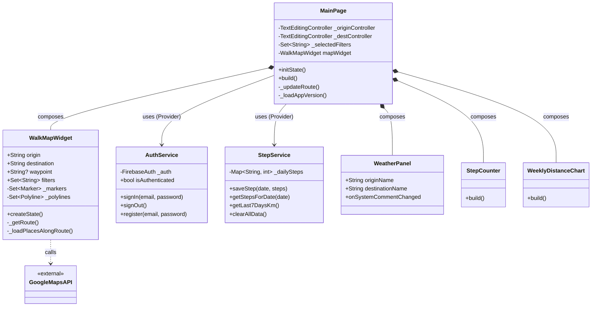

# クラス図

## クラス図 (Mermaid)

## クラス概要

*   **MainPage**: アプリのメイン画面。ユーザー入力（出発地・目的地）、フィルタ選択、各コンポーネントのレイアウトを管理する。
*   **WalkMapWidget**: 地図機能の中核。Google Mapsを表示し、Directions APIでルートを取得、Places APIで周辺施設を検索してマーカーを表示する。
*   **AuthService**: Firebase Authenticationを使用した認証機能（ログイン、登録、ログアウト）を提供する。
*   **StepService**: 歩数データの管理を行う。SharedPreferencesを使用してローカルにデータを保存・読み込みし、週間データの計算なども担当する。
*   **WeatherPanel**: 経路に関連する天気情報を表示するコンポーネント。
*   **StepCounter**: 今日の歩数を表示するUIコンポーネント。
*   **WeeklyDistanceChart**: 過去7日間の移動距離をグラフ表示するコンポーネント。
