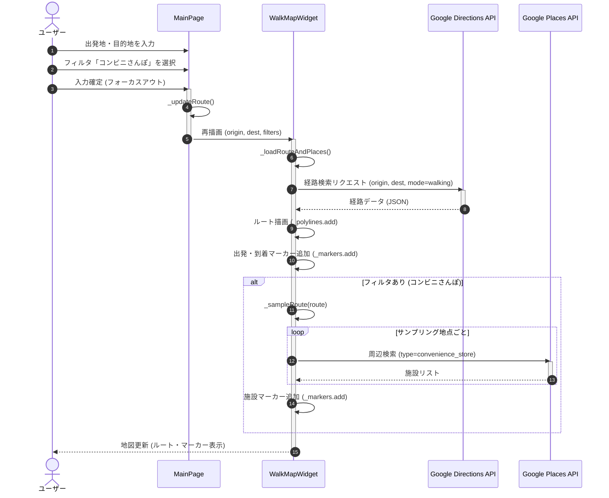

# シーケンス図

## シーケンス図 (Mermaid)
**シナリオ**: ユーザーがルート検索を行い、周辺のコンビニを表示する。

## 処理の流れ記述

1.  **入力**: ユーザーが`MainPage`の入力フィールドに出発地と目的地を入力し、「コンビニさんぽ」フィルタを選択する。
2.  **更新トリガー**: 入力フィールドからフォーカスが外れると、`_onFocusChange`が発火し、`_updateRoute`が呼び出される。
3.  **状態更新**: `MainPage`の状態（State）が更新され、`WalkMapWidget`が新しい引数（出発地、目的地、フィルタ）で再ビルドされる。
4.  **データ取得開始**: `WalkMapWidget`の`didUpdateWidget`（または初期化時）から`_loadRouteAndPlaces`が呼び出される。
5.  **経路検索**: Google Directions APIに対して、徒歩ルートの検索リクエストを送信する。
6.  **ルート描画**: 取得した経路データからポリライン（経路線）を作成し、地図上に描画する。同時に出発地・目的地のマーカーを追加する。
7.  **周辺施設検索**: フィルタが有効な場合、ルート上の地点をサンプリングし、各地点周辺の「コンビニ」をGoogle Places APIで検索する。
8.  **マーカー表示**: 検索で見つかったコンビニをマーカーとして地図に追加する。
9.  **完了**: ユーザーにルートと周辺施設が表示された地図が提示される。
