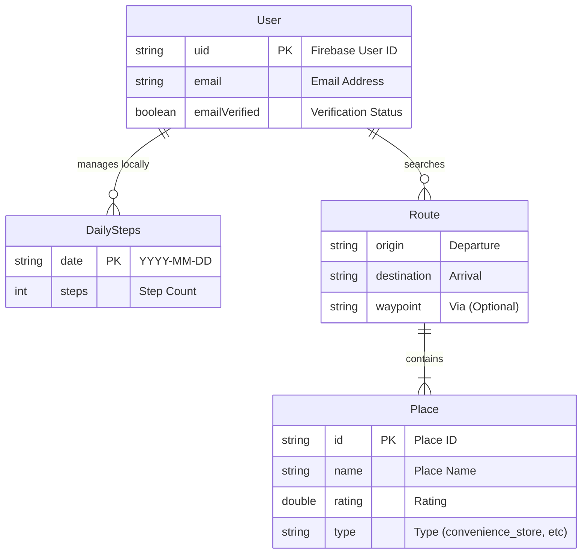

# テーブル設計書 (データモデル・ストレージ設計)

## 1. 概要
本アプリケーション「さんぽAI」は、大規模なリレーショナルデータベースを使用せず、以下の構成でデータを管理しています。

*   **ユーザー認証・管理**: Firebase Authentication
*   **ローカルデータ永続化**: SharedPreferences (デバイス内ストレージ)
*   **外部データ**: Google Maps API, Open-Meteo API (都度取得)

本ドキュメントでは、これらのデータ構造および永続化の仕様について定義します。

---

## 2. ER図 (データモデル概念図)



---

## 3. ストレージ設計詳細

### 3.1. ローカルストレージ (SharedPreferences)

歩数データの永続化に使用します。データはJSON形式でシリアライズされて保存されます。

| Key | Type | Description | Example Value |
| :--- | :--- | :--- | :--- |
| `daily_steps_data` | String (JSON) | 日付ごとの歩数を記録するマップ | `{"2023-10-27": 5000, "2023-10-28": 7500}` |

#### JSON構造詳細 (`daily_steps_data`)

```json
{
  "YYYY-MM-DD": int,
  "YYYY-MM-DD": int,
  ...
}
```

*   **Key**: 日付文字列 (ISO 8601 format: `YYYY-MM-DD`)
*   **Value**: 歩数 (Integer)

### 3.2. ユーザー管理 (Firebase Authentication)

クラウド上のFirebase Authenticationサービスにて管理されるユーザー情報です。

| Field | Type | Description | Note |
| :--- | :--- | :--- | :--- |
| `uid` | String | ユーザー一意識別子 | Primary Key |
| `email` | String | メールアドレス | ログインIDとして使用 |
| `emailVerified` | Boolean | メールアドレス確認済みフラグ | `true` の場合のみログイン可 |
| `password` | String | パスワード | Firebase内部でハッシュ化して保存 |

---

## 4. インメモリ / API データモデル

アプリケーション実行中にメモリ上に展開される主要なデータモデルです（DBには保存されません）。

### 4.1. Place (周辺施設)
Google Places APIから取得したデータ。

| Field | Type | Description |
| :--- | :--- | :--- |
| `place_id` | String | Google Place ID |
| `name` | String | 施設名 |
| `lat` | Double | 緯度 |
| `lng` | Double | 経度 |
| `rating` | Double | 評価 (1.0 - 5.0) |
| `price_level` | Int | 価格帯 (0 - 4) |
| `types` | List<String> | 施設タイプ (例: `convenience_store`) |

### 4.2. Weather (天気情報)
Open-Meteo APIから取得したデータ。

| Field | Type | Description |
| :--- | :--- | :--- |
| `weathercode` | Int | WMO天気コード |
| `temperature` | Double | 現在気温 |
| `max_temp` | Double | 最高気温 |
| `min_temp` | Double | 最低気温 |

