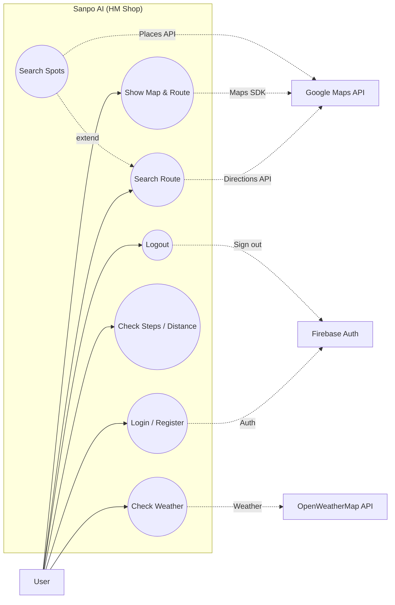

# ユースケース図・記述

## 1. ユースケース図 (Mermaid - Compatible Version)

> Note: Changed to `flowchart` syntax for better compatibility with older Mermaid renderers.

## 2. ユースケース記述

### UC1: ログイン/登録
*   **概要**: ユーザーがアプリを利用するためにアカウントを作成、または既存のアカウントでログインする。
*   **アクター**: ユーザー
*   **事前条件**: なし
*   **事後条件**: ユーザーが認証され、メイン画面に遷移する。
*   **主な流れ**:
    1.  ユーザーがメールアドレスとパスワードを入力する。
    2.  システムがFirebase Authに認証を要求する。
    3.  認証成功後、システムはメイン画面を表示する。

### UC3: ルート検索
*   **概要**: 出発地、目的地（および任意の経由地）を指定して、ウォーキングルートを検索する。
*   **アクター**: ユーザー
*   **事前条件**: ログイン済みであること。
*   **事後条件**: 地図上にルートが表示される。
*   **主な流れ**:
    1.  ユーザーが出発地、目的地を入力する（任意で経由地も入力）。
    2.  ユーザーが入力を確定する（フォーカスを外す等）。
    3.  システムがGoogle Maps Directions APIに経路情報をリクエストする。
    4.  システムが取得した経路を地図上に描画する。

### UC5: スポット検索・表示
*   **概要**: 設定されたフィルタ（コンビニ、カフェ等）に基づき、ルート周辺のスポットを検索・表示する。
*   **アクター**: ユーザー
*   **事前条件**: ルートが表示されていること。
*   **主な流れ**:
    1.  ユーザーが「コンビニさんぽ」や「買い物さんぽ」などのフィルタを選択する。
    2.  システムがルート周辺の施設をGoogle Places APIで検索する。
    3.  該当する施設が地図上にマーカーとして表示される。

### UC6: 歩数・距離確認
*   **概要**: 日々の歩数と移動距離（週間グラフ）を確認する。
*   **アクター**: ユーザー
*   **事前条件**: アプリがインストールされており、歩数が記録されていること。
*   **主な流れ**:
    1.  ユーザーがメイン画面を表示する。
    2.  システムがローカルストレージ（SharedPreferences）から歩数データを読み込む。
    3.  システムが当日の歩数と週間移動距離グラフを表示する。
